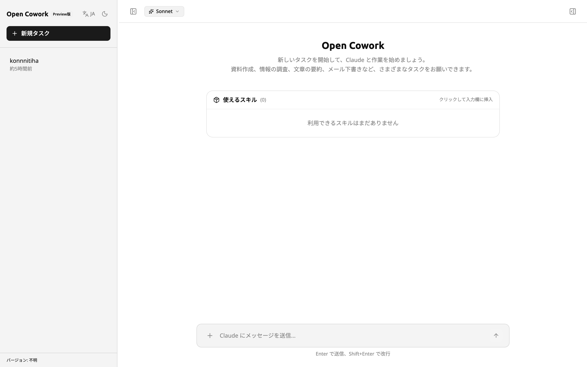
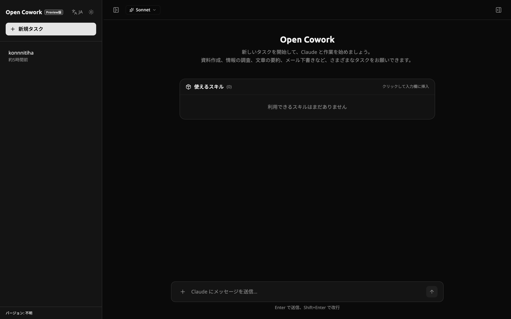

# Open Cowork

[日本語版 / Japanese version](./README.ja.md)

A self-hosted AI assistant chat, powered by [`@earendil-works/pi-coding-agent`](https://github.com/earendil-works/pi/tree/main/packages/coding-agent). Chat with Claude in your browser, organise work in named tasks, and bundle reusable workflows as *skills* you can summon with a slash.

<p align="center">
  
  <br />
  <em>Welcome screen (light / dark themes)</em>
  <br />
  
</p>

## Features

- 🧵 **Tasks** — Each conversation is a persistent task you can rename, archive, and resume.
- 🛠️ **Skills** — Drop a `SKILL.md` file in your project, then call it from the chat with `/skill-name`.
- 📎 **Attachments** — Drag in PDFs, images, and Office documents; the agent reads them inline.
- 🎨 **HTML artifacts** — Code blocks tagged `html` render live in a side-by-side preview.
- 🌗 **Light / dark themes** with a monochrome design that stays out of the way.

## Quick Start

### Prerequisites

- [Node.js 22+](https://nodejs.org/) and [pnpm 10+](https://pnpm.io/installation)
- [Docker Desktop](https://www.docker.com/products/docker-desktop/) (used to run a local DynamoDB for chat history)
- An [Anthropic API key](https://console.anthropic.com/) for live agent responses (optional — see *Mock mode* below)

### 1. Install

```bash
git clone https://github.com/reibomaru/open-cowork.git
cd open-cowork
pnpm install
```

### 2. Configure

```bash
cp server/.env.example server/.env
cp client/.env.example client/.env
```

Then open `server/.env` and add your API key:

```bash
ANTHROPIC_API_KEY=sk-ant-...
```

### 3. Run

```bash
pnpm dev
```

This starts the backend (in Docker) and the Vite dev server. Open <http://localhost:5173> and start chatting.

### Mock mode (no API key needed)

To try the UI without an API key, set `USE_MOCK=true` in `server/.env`. The app responds with canned messages so you can explore tasks, attachments, and skills without billing.

## Using Skills

A *skill* is a Markdown file the agent loads as a reusable system prompt. Drop a `SKILL.md` into `common-skills/skills/<name>/` and the agent picks it up on the next message. In chat, summon it by typing:

```
/<skill-name> your additional prompt here
```

You'll see the matching skill in the welcome screen's skill catalog as well.

## Configuration

The most common settings live in `server/.env`:

| Variable | Purpose |
|----------|---------|
| `ANTHROPIC_API_KEY` | Your Anthropic API key. |
| `MODEL_PROVIDER` | Provider used by default (`anthropic`, `amazon-bedrock`, etc.). |
| `USE_MOCK` | `true` to use the in-memory mock agent; `false` for the real LLM. |
| `DEV_USER_ID` | Local userId fallback when no auth header is present. |

See `server/.env.example` for the full list and inline notes.

## Documentation

- [日本語 README](./README.ja.md)
- [Developer guide](./docs/DEVELOPMENT.md) — architecture, project layout, scripts, etc.
- [`@earendil-works/pi-coding-agent`](https://github.com/earendil-works/pi/tree/main/packages/coding-agent) — the underlying agent runtime.
